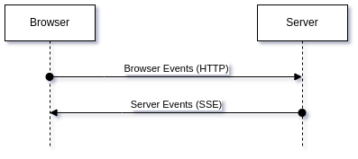
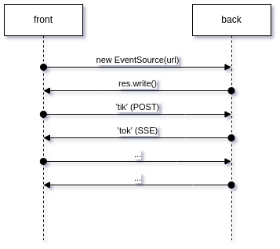

# Events with HTTP POST & SSE

Demo application for event driven communication in web applications.

## Overview

It is possible to send frontend events to backend using regular HTTP POST request (`fetch`) and to receive backend
events with `EventSource` ([Server Sent Events](https://developer.mozilla.org/en-US/docs/Web/API/Server-sent_events)):



This demo will send `tik` event from front to back on every `tok` event from back. Back, in turn, will send `tok` event
on every `tik` event received from front. Front starts sending when `EventSource` connection is opened:



This event-driven communication model can be used in mobile web
apps ([PWA](https://developer.mozilla.org/en-US/docs/Web/Progressive_web_apps)) where Internet connection can be very
unstable.

It is not a production ready solution. It's just a principal demo.

## Install

```shell
$ git clone https://github.com/flancer64/demo_teqfw_events_tiktok
$ cd demo_teqfw_events_tiktok
$ npm run rebuild
```

## Run

Launch backend application (HTTP/1 server on port 8080) from `npm`:

```shell 
$ npm start // start backend application as HTTP/1 server on port 8080 with 'npm'
$ node ./bin/tequila.mjs web-server-start -1 -p 3000 // start as HTTP/1 server on port 3000
$ node ./bin/tequila.mjs web-server-start // start as HTTP/2 server on port 8080
```

## Usage

Start backend app then open URL http://localhost:8080/ in your browser. Front application will be loaded and connected
to backend app. After that front will send first `tik` event to back. Back will answer with `tok` event with random
delay (0.1-1 sec.). Front will get `tok` event from back then answer with `tik` event with the same random delay (0.1-1
sec.).

Open DevTools panel in browser and see logs in console. Server logs are flowed to standard output.

Front application will try to re-connect to back every 5 sec. in case of back application will be down or connection
will be lost.

You can open the same address in separate browsers, backend will serve all fronts with `tok` events.

## Details

All sources are 'vanilla JS' (ES2015+), so you can set break points to debug al processes (in browser and in node app).
This project does not use 'TS-to-JS' transpiling.

### 'Front-to-back' communication channel

Front sends event
messages ([TeqFw_Web_Front_App_Connect_Event_Direct](https://github.com/teqfw/web/blob/0b3a9d84b91cdcf3fa2c462392897bd979edd2da/src/Front/App/Connect/Event/Direct.mjs#L37)):

```javascript
const res = await fetch(_url, {
    method: 'POST',
    headers: {
        'Content-Type': 'application/json'
    },
    body: JSON.stringify(data)
});
```

Back
receives ([TeqFw_Web_Back_App_Server_Handler_Event_Direct](https://github.com/teqfw/web/blob/0b3a9d84b91cdcf3fa2c462392897bd979edd2da/src/Back/App/Server/Handler/Event/Direct.mjs#L48)):

```javascript
async function process(req, res) {
    /** @type {TeqFw_Core_Shared_Mod_Map} */
    const shares = res[DEF.HNDL_SHARE];
    if (!res.headersSent && !shares.get(DEF.SHARE_RES_STATUS)) {
        try {
            const json = shares.get(DEF.SHARE_REQ_BODY_JSON);
            const item = fQueueItem.create(json);
            logger.info(`Event message '${item.eventName}' from front '${item.frontUUID}' is received.`);
            frontEmbassy.emit(item.eventName, item.eventData);
            res.setHeader(HTTP2_HEADER_CONTENT_TYPE, 'application/json');
            shares.set(DEF.SHARE_RES_STATUS, HTTP_STATUS_OK);
        } catch (e) {
            logger.error(e);
            respond500(res, e?.message);
        }
    }
}
```

### 'Back-to-front' communication channel

Front opens event sources
stream ([TeqFw_Web_Front_App_Connect_Event_Reverse](https://github.com/teqfw/web/blob/0b3a9d84b91cdcf3fa2c462392897bd979edd2da/src/Front/App/Connect/Event/Reverse.mjs#L79)):

```javascript
const url = `${_url}/${frontUUID.get()}`;
_source = new EventSource(url);
```

Back send event
messages ([TeqFw_Web_Back_App_Server_Handler_Event_Reverse](https://github.com/teqfw/web/blob/0b3a9d84b91cdcf3fa2c462392897bd979edd2da/src/Back/App/Server/Handler/Event/Reverse.mjs#L106)):

```javascript
conn.write = function (payload) {
    if (res.writable) {
        const json = JSON.stringify(payload);
        res.write(`data: ${json}\n\n`);
        res.write(`id: ${conn.messageId++}\n`);
    } else {
        logger.error(`Back-to-front events stream is not writable (front: '${frontStamp}')`);
    }
};
```

Front
receives ([TeqFw_Web_Front_App_Connect_Event_Reverse](https://github.com/teqfw/web/blob/0b3a9d84b91cdcf3fa2c462392897bd979edd2da/src/Front/App/Connect/Event/Reverse.mjs#L102)):

```javascript
_source.addEventListener('message', function (event) {
    try {
        const obj = JSON.parse(event.data);
        /** @type {TeqFw_Web_Shared_App_Event_Queue_Trans_BfItem} */
        const item = fQueueItem.create(obj);
        logger.info(`Event message '${item.eventName}' from back '${item.backUUID}' is received.`);
        embassy.emit(item.eventName, item.eventData);
    } catch (e) {
        console.error(e);
    }
});
```
